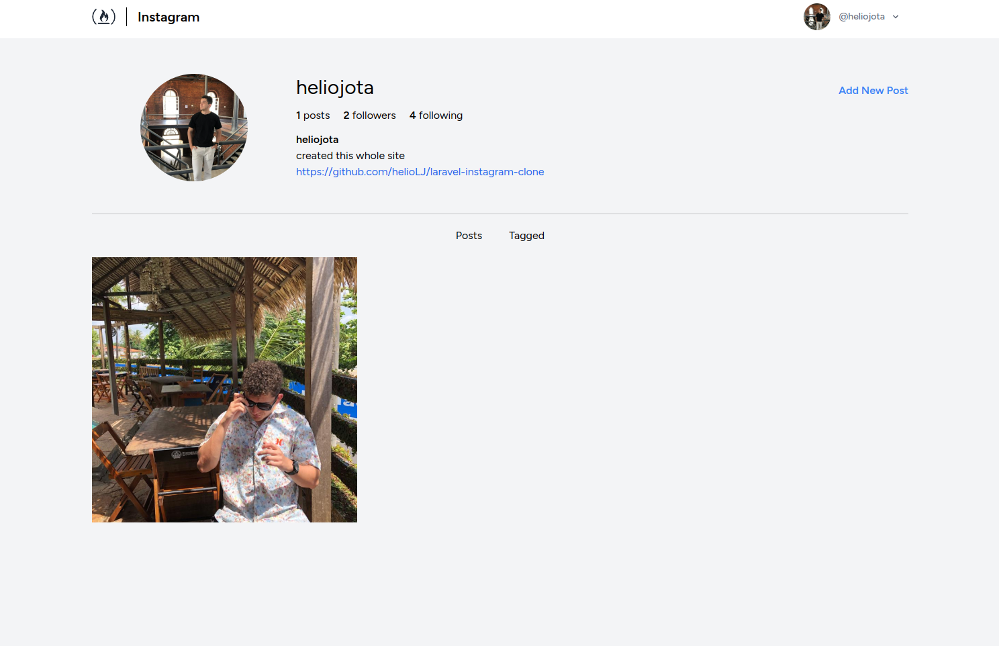
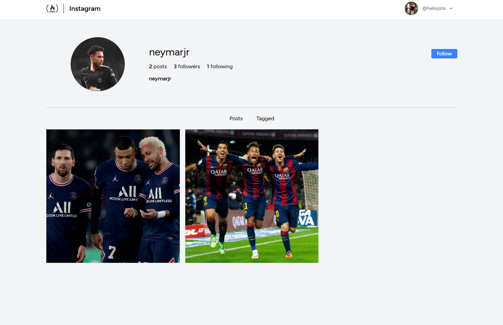
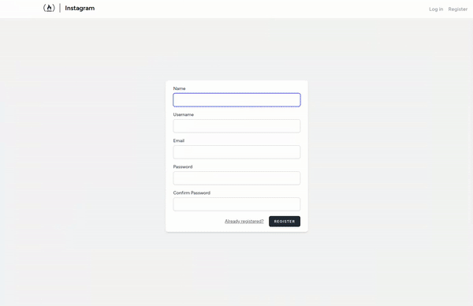

# Instagram Clone with Laravel Sail and Vue.js
This project is an Instagram clone built using PHP Laravel Sail as the backend and Vue.js for the frontend. It mimics some of the core functionality of Instagram, allowing users to upload photos, follow other users, and like and comment on posts.



## Features
[x] User registration and authentication

[x] Post creation and image uploads

[x] User profiles with profile pictures

[x] Follow and unfollow other users

[ ] Like and comment on posts

[x] News feed displaying posts from followed users

## Technologies Used
- Laravel Sail: Laravel Sail is a lightweight command-line tool for managing Laravel applications within Docker containers. It simplifies the development environment setup.
- Laravel: Laravel is a popular PHP framework known for its elegant syntax and developer-friendly features.
- Vue.js: Vue.js is a progressive JavaScript framework for building user interfaces. It's used for the frontend of this project to create dynamic and interactive components.
- Tailwind CSS: Tailwind CSS is a utility-first CSS framework that helps in rapidly building custom-designed web applications.
- MySQL: The project uses MySQL as the database to store user data, posts, likes, and comments.

## Getting Started
Follow these steps to get the Instagram clone up and running on your local development environment.

### Pre-requisites
Make sure you have Docker installed on your system.
Installation
Clone the repository:

```bash
git clone https://github.com/helioLJ/laravel-instagram-clone.git
```
Navigate to the project directory:

```bash
cd laravel-instagram-clone
```
Copy the .env.example file to .env:

```bash
cp .env.example .env
```
Start the Docker containers using Laravel Sail:


```bash
./vendor/bin/sail up -d
```

Run the database migrations and seed the database:

```bash
./vendor/bin/sail artisan db:seed
```

Install the frontend dependencies and build the assets:

```bash
./vendor/bin/sail npm install
./vendor/bin/sail npm run dev
```

Your Instagram clone should now be accessible at http://localhost.

## Usage
Register for an account and start using the Instagram clone to upload photos, follow users, like posts, and comment on content.
Contributing
If you'd like to contribute to this project, please follow these guidelines:

- Clone the repository.
- Create a new branch for your feature or bug fix.
- Make your changes and commit them with clear commit messages.
- Push your changes to your fork.
- Create a pull request to the main repository.


## Acknowledgments
This project was inspired by the Instagram platform.
Special thanks to the Laravel, Vue.js, and Tailwind CSS communities for creating amazing tools and resources.

## Contact
If you have any questions or suggestions, please feel free to contact us at contato@heliodev.tech

## License

The Laravel framework is open-sourced software licensed under the [MIT license](https://opensource.org/licenses/MIT).
